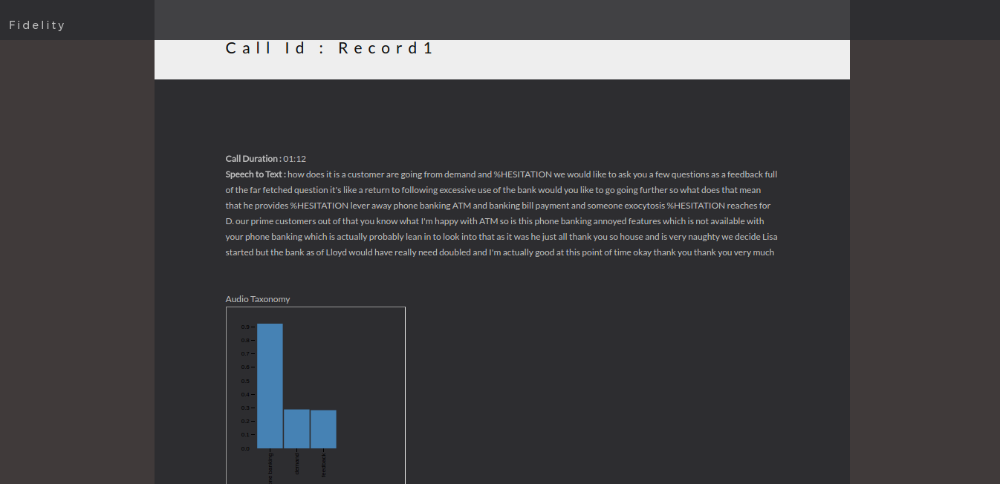
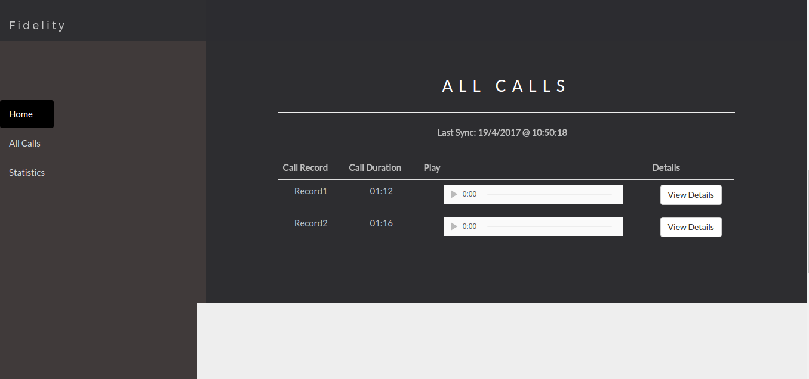
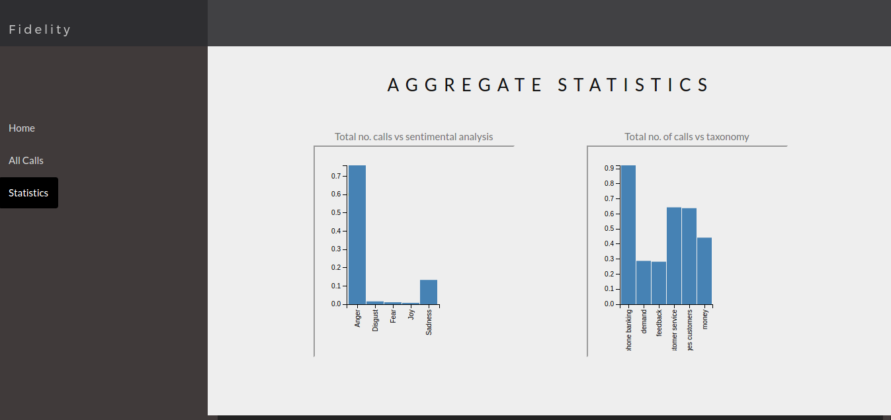

# Customers Voices Analyzation
## Ear Drums

Good information drives great decisions, but it's hard to find everything you need in one place. We developed a solution where customer phone calls are analysed through Natural Language Processing. 
We processed the calls to extract out the following useful information:  
1. The taxonomy model for the domain.
2. Converted audio files to textual transcripts.
3. Detected and categorised them on the basics of nature of call and the emotion of the caller.
4. Made a dashboard to show all the data along with graphs between various important parameters.

### Installation
* Install npm

* Clone this repository

`git clone https://github.com/gauravb12/eardrumsNITD.git`

* Install the node dependencies  

`cd eardrumsNITD
npm install`

* To run in web browser run

`nodemon app.js`

### Technological Stack:
* HTML,CSS and bootstrap  
* D3.js for graphs
* Node.js and Express.js
* MongoDB
* Watson API for NLP 

## Screenshots:

### Login Page:  

### Call Details:  

  
### History of Calls:

### Summary of Calls:

[Slides](https://docs.google.com/presentation/d/1qFSmomAyIxEuo0fJsMf9RDxzA2yQW-d8b9Mm7uw4mLA/edit#slide=id.g1d82774b77_0_50https://docs.google.com/presentation/d/1qFSmomAyIxEuo0fJsMf9RDxzA2yQW-d8b9Mm7uw4mLA/edit#slide=id.g1d82774b77_0_50)
